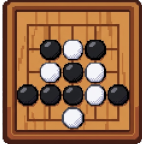
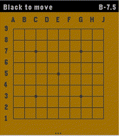
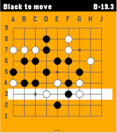
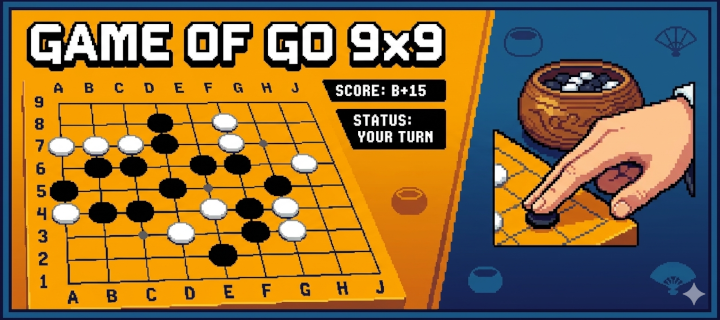

# Game of Go 9x9 on Pebble

[Game of Go app](https://apps.repebble.com/35ad80179c4145118edca560)

This app brings the game of Go / Baduk / Weiqi to the Pebble Time 2 with a fast,
fully-featured engine and a polished interface.
Go is the ultimate mental workout for your commute or coffee break.

Features:
* Board 9x9, Chinese rules (Stones + Territory)
* AI algorithm based on Monte Carlo Tree Search.
* Game modes: Player vs Player, Human vs AI (Black or White), and even AI vs AI mode.
* Intuitive two-step stone placement designed specifically for the Pebble's buttons.
* A real-time score estimate, keeping you informed of who's winning at every turn.
* 100% offline - all computations happen on the local device, pushing Pebble's capabilities to the boundaries.
* AI hints - stuck on the next move? Ask the AI for a suggestion.
* Authentic look: standard coordinate labels (1-9, A-J), Hoshi (star) points, and a wooden board aesthetic

How to Play:
1. Select Row: Use UP/DOWN to highlight a row, then press SELECT.
2. Select Column: Use UP/DOWN to move the cursor horizontally, then press SELECT to place your stone.
3. Press BACK to open Menu to Pass, start a New Game, or get a Hint.

---

Love the game? Please leave a ❤️ on the Pebble App Store! Your support helps me keep improving the AI and adding new features like persistent saves and larger boards.

